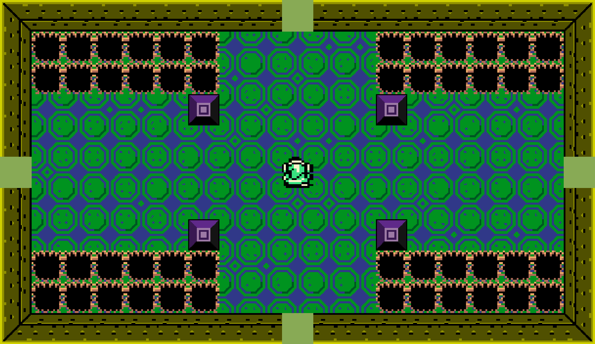
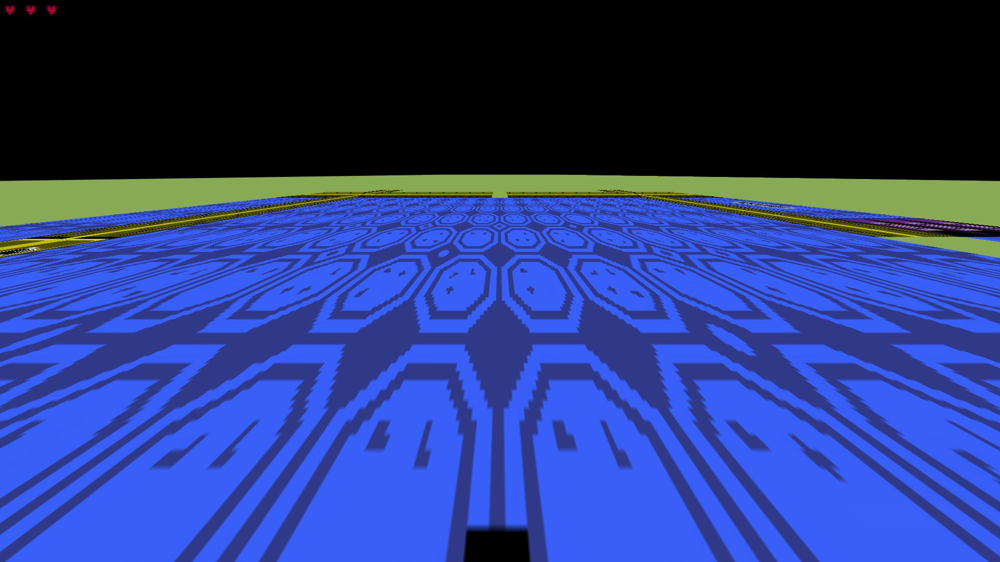

# MaingronZelda

## About Maingron Zelda
Maingron Zelda is written in JavaScript and rendered as HTML elements. (S)CSS is also used.  
Maingron Zelda is, for the most part, an archived project. I once started it at work and it was pretty cool at that time. Eventually though, performance issues started to appear and they became very problematic pretty quickly. At that time development still continued and I tried to "optimize" the engine. Unfortunately due to how browsers render websites and how the game works, there isn't much that could be optimized.  
Eventually then the announcement was made that the game will be discontinued and eventually a new version with a new engine will appear. As of August 2021, there still isn't really much progress towards the new version but only parts of a level editor that allow to select a sprite from a spritesheet. The WIP title of the new game is called [Maingron Zelda 3](//github.com/Maingron/maingronZelda-3).

Development started in 2019.  
Development was suspended after 2019
Development was briefly resumed in 2022 to make some slight improvements

## Screenshots
Screenshots taken during development

|||
| :-: | :-: |
|  |  |
|  |  |
|  |  |
|  |  |

### Other graphical ressources
|||
| :-: | :-: |
|  |  |

---
Project Website: https://maingron.com/maingron_zelda  
GitHub Site: https://github.com/maingron/maingronZelda
